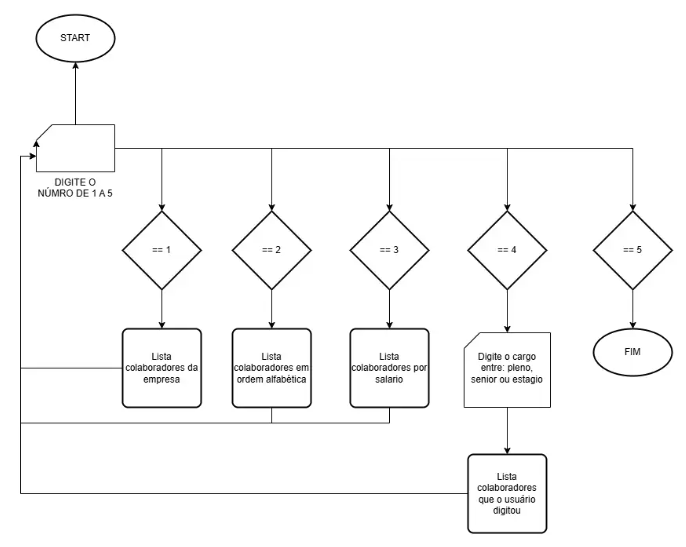

# Backup de Estudos
Segue o material de diversas atividade que foi realizado manualmente para estudo tecnico

## [Atividade1-1](<Atividade1-1>)

Comprendendo como criar de forma clara uma decrição narrativa
>   [Descrição narrativa do primeiro projeto](<Atividade1-1/DESCRIÇÃO NARRATIVA/Descrição Narrativa Atv1-1.txt>)

Compreendendo conceitos como descrição narrativa e fluxograma para começar a criação de um projeto
    
>   Fluxograma simples de como funconaria 
>
>   

Programa gerado pelo terminal realizando o passo a passo

>[Pasta em que foi feita](<Atividade1-1/PROGRAM>) e distribuida em três projetos
>
>[main](<Atividade1-1/PROGRAM/main.py>) executa o programa
>
>[lista](<Atividade1-1/PROGRAM/lista.py>) onde ida com os dados
>
>[action](<Atividade1-1 /PROGRAM/action.py>) onde gera a interface

## [Atividade1-2 ](<Atividade1-1>)

Evoluindo com o tratamento dos [dados](Atividade1-2/data), dessa vez convertendo dados json, csv e xml para converte-los em Data Fame para aplicar no pandas

>   [main](Atividade1-2/main/main.py) 
    executa o programa

>   [conversao](Atividade1-2/main/conversao.py) 
    converte os dados em data frame

>   [grafico](Atividade1-2/main/grafrico.py)
    utiliza os dados tratados e cria uma tabela de pessoas por região

>   [mapa](Atividade1-2/main/mapa.py) 
    utiliza os dados para crias uma localização geografica de onde as pessoas moram usando a API do via cep para converter em coordenada e marcar no mapa feito por HTML

>   [ttkkkk](Atividade1-2/main/ttkkk.py) criando a logica por trás da interface gráfica que executa o programa

## [Atividade_Ragex](Atividade_Ragex)

